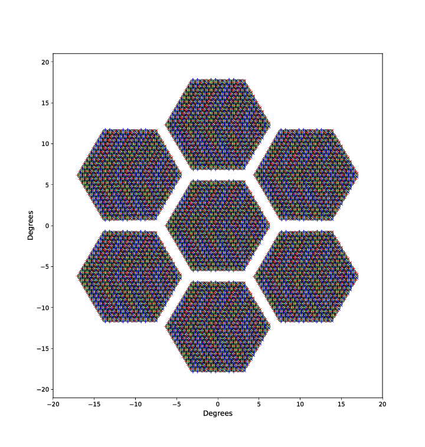

.. _cli:

Command Line Tools
========================

The command line interface to sotodlib is mostly convenience wrappers around high level functions in the package.

Hardware Configuration
-------------------------

There are several tools for simulating, selecting subsets from, and plotting
hardware configurations.  Currently the code writes hardware configuration data
into the `TOML <https://github.com/toml-lang/toml/wiki>`_ format, which can
represent basic scalar data types as well as lists and dictionaries.  Under the
hood it `uses the python toml package <https://github.com/uiri/toml>`_.  This
format is simple to read and even edit manually (hopefully that will be a rare
occurrence!).  By default the dumping functions write this data in gzipped
files and loading supports both gzipped and uncompressed TOML files.

Simulating
~~~~~~~~~~~~~~~~~~~

Until we have real hardware properties we can create a mock configuration with
this script:

.. include:: _static/so_hardware_sim.inc

You can specify the output file root name (the toml and gz extensions will be
added) and whether to overwrite any existing file by the same name.

Basic Info
~~~~~~~~~~~~~~~~

You can dump very basic info about a hardware file with this tool:

.. include:: _static/so_hardware_info.inc

If you need more details, you should just get an interactive python session and
load the hardware model and explore it.

Selecting / Trimming Detectors
~~~~~~~~~~~~~~~~~~~~~~~~~~~~~~~~~~~

Starting with a large hardware model for the whole experiment, we usually want to select a subset of the detectors in order to do some analysis task.  You can use this command line tool to read an existing hardware configuration, apply some selection, and dump out the result as a new configuration.  Under the hood this just uses the :meth:`sotodlib.hardware.Hardware.select` method.

.. include:: _static/so_hardware_trim.inc

Basically you can do a coarse selection by telescope or tube, as well as apply other selection criteria on the detector properties.  See the example below.

Visualization
~~~~~~~~~~~~~~~~~

.. include:: _static/so_hardware_plot.inc

Example
~~~~~~~~~~~~~~~~~~~~~~~~

Putting the previously discussed tools together, let's make a plot of just detectors on SAT2 that are in wafers 33 and 38, in band MFS2, have "A" polarization ("A"/"B" are the 2 orthogonal polarizations), and which are in pixels 20-29 and 50-55.  This is a very artificial selection, but demonstrates the use of the tools.  First simulate the full hardware configuration::

    %> so_hardware_sim --out hardware_all --overwrite

    Getting example config...
    Simulating detectors for telescope LAT...
    Simulating detectors for telescope SAT0...
    Simulating detectors for telescope SAT1...
    Simulating detectors for telescope SAT2...
    Simulating detectors for telescope SAT3...
    Dumping config to hardware_all.toml.gz...

Although the output file is only a few MB, we can see it has a lot of stuff in there::

    %> so_hardware_info hardware_all.toml.gz

    Loading hardware file hardware_all.toml.gz...
    cards       :    48 objects
        00, 01, 02, 03, 04, 05, 06, 07, 08, 09, 10, 11, 12, 13, 14, 15, 16, 17,
        18, 19, 20, 21, 22, 23, 24, 25, 26, 27, 28, 29, 30, 31, 32, 33, 34, 35,
        36, 37, 38, 39, 40, 41, 42, 43, 44, 45, 46, 47
    crates      :     8 objects
        0, 1, 2, 3, 4, 5, 6, 7
    bands       :     8 objects
        LF1, LF2, MFF1, MFF2, MFS1, MFS2, UHF1, UHF2
    wafers      :    49 objects
        00, 01, 02, 03, 04, 05, 06, 07, 08, 09, 10, 11, 12, 13, 14, 15, 16, 17,
        18, 19, 20, 21, 22, 23, 24, 25, 26, 27, 28, 29, 30, 31, 32, 33, 34, 35,
        36, 37, 38, 39, 40, 41, 42, 43, 44, 45, 46, 47, 48
    tubes       :    11 objects
        LT0, LT1, LT2, LT3, LT4, LT5, LT6, ST0, ST1, ST2, ST3
    telescopes  :     5 objects
        LAT, SAT0, SAT1, SAT2, SAT3
    detectors   : 66844 objects
        (Too many to print)

This is the kind of file that in the future could be versioned and be associated with a valid time range.  It should really just be used as the starting input.  First let's trim out just the detectors on SAT2::

    %> so_hardware_trim --hardware hardware_all.toml.gz \
       --out sat2 --overwrite \
       --telescopes SAT2

    Loading hardware from hardware_all.toml.gz...
    Selecting detectors from:
      telescopes = 'SAT2'
    Dumping selected config to sat2.toml.gz...

This produces a file called "sat2.toml.gz".  This has only detectors on this telescope::

    %> so_hardware_info sat2.toml.gz

    Loading hardware file sat2.toml.gz...
    cards       :     7 objects
        32, 36, 37, 34, 35, 38, 33
    crates      :     2 objects
        5, 6
    bands       :     2 objects
        MFS2, MFS1
    tubes       :     1 objects
        ST2
    telescopes  :     1 objects
        SAT2
    wafers      :     7 objects
        32, 36, 37, 34, 35, 38, 33
    detectors   : 11116 objects
        (Too many to print)

We can plot this as well::

    %> so_hardware_plot --hardware sat2.toml.gz \
       --out sat2.pdf

    Loading hardware file sat2.toml.gz...
    Generating detector plot...

This outputs a PDF that you can "zoom in" to see details, but the image here is
just a low-res PNG.

Back to our original selection goal.  We can use lists of values to match detector properties or valid python regular expressions.  We can trim out just those detectors with::

    %> so_hardware_trim --hardware sat2.toml.gz \
       --out my_dets --overwrite --match \
       "wafer:33,38" \
       "band:MFS2" \
       "pol:A" \
       "pixel:(2.|5[0-5])"

    Loading hardware from sat2.toml.gz...
    Selecting detectors from:
      wafer = r'['33', '38']'
      band = r'MFS2'
      pol = r'A'
      pixel = r'(2.|5[0-5])'
    Dumping selected config to my_dets.toml.gz...

Now explore this selection result::

    %> so_hardware_info my_dets.toml.gz

    Loading hardware file my_dets.toml.gz...
    cards       :     2 objects
        38, 33
    crates      :     2 objects
        6, 5
    bands       :     2 objects
        MFS1, MFS2
    tubes       :     1 objects
        ST2
    telescopes  :     1 objects
        SAT2
    wafers      :     2 objects
        38, 33
    detectors   :   200 objects
        33_200_MFS2_A, 33_201_MFS2_A, 33_202_MFS2_A, 33_203_MFS2_A,
        33_204_MFS2_A, 33_205_MFS2_A, 33_206_MFS2_A, 33_207_MFS2_A,
        33_208_MFS2_A, 33_209_MFS2_A, 33_210_MFS2_A, 33_211_MFS2_A,
        33_212_MFS2_A, 33_213_MFS2_A, 33_214_MFS2_A, 33_215_MFS2_A,
        33_216_MFS2_A, 33_217_MFS2_A, 33_218_MFS2_A, 33_219_MFS2_A,
        33_220_MFS2_A, 33_221_MFS2_A, 33_222_MFS2_A, 33_223_MFS2_A,
        33_224_MFS2_A, 33_225_MFS2_A, 33_226_MFS2_A, 33_227_MFS2_A,
        33_228_MFS2_A, 33_229_MFS2_A, 33_230_MFS2_A, 33_231_MFS2_A,
        33_232_MFS2_A, 33_233_MFS2_A, 33_234_MFS2_A, 33_235_MFS2_A,
        33_236_MFS2_A, 33_237_MFS2_A, 33_238_MFS2_A, 33_239_MFS2_A,
        33_240_MFS2_A, 33_241_MFS2_A, 33_242_MFS2_A, 33_243_MFS2_A,
        33_244_MFS2_A, 33_245_MFS2_A, 33_246_MFS2_A, 33_247_MFS2_A,
        33_248_MFS2_A, 33_249_MFS2_A, 33_250_MFS2_A, 33_251_MFS2_A,
        33_252_MFS2_A, 33_253_MFS2_A, 33_254_MFS2_A, 33_255_MFS2_A,
        33_256_MFS2_A, 33_257_MFS2_A, 33_258_MFS2_A, 33_259_MFS2_A,
        33_260_MFS2_A, 33_261_MFS2_A, 33_262_MFS2_A, 33_263_MFS2_A,
        33_264_MFS2_A, 33_265_MFS2_A, 33_266_MFS2_A, 33_267_MFS2_A,
        33_268_MFS2_A, 33_269_MFS2_A, 33_270_MFS2_A, 33_271_MFS2_A,
        33_272_MFS2_A, 33_273_MFS2_A, 33_274_MFS2_A, 33_275_MFS2_A,
        33_276_MFS2_A, 33_277_MFS2_A, 33_278_MFS2_A, 33_279_MFS2_A,
        33_280_MFS2_A, 33_281_MFS2_A, 33_282_MFS2_A, 33_283_MFS2_A,
        33_284_MFS2_A, 33_285_MFS2_A, 33_286_MFS2_A, 33_287_MFS2_A,
        33_288_MFS2_A, 33_289_MFS2_A, 33_290_MFS2_A, 33_291_MFS2_A,
        33_292_MFS2_A, 33_293_MFS2_A, 33_294_MFS2_A, 33_295_MFS2_A,
        33_296_MFS2_A, 33_297_MFS2_A, 33_298_MFS2_A, 33_299_MFS2_A,
        38_200_MFS2_A, 38_201_MFS2_A, 38_202_MFS2_A, 38_203_MFS2_A,
        38_204_MFS2_A, 38_205_MFS2_A, 38_206_MFS2_A, 38_207_MFS2_A,
        38_208_MFS2_A, 38_209_MFS2_A, 38_210_MFS2_A, 38_211_MFS2_A,
        38_212_MFS2_A, 38_213_MFS2_A, 38_214_MFS2_A, 38_215_MFS2_A,
        38_216_MFS2_A, 38_217_MFS2_A, 38_218_MFS2_A, 38_219_MFS2_A,
        38_220_MFS2_A, 38_221_MFS2_A, 38_222_MFS2_A, 38_223_MFS2_A,
        38_224_MFS2_A, 38_225_MFS2_A, 38_226_MFS2_A, 38_227_MFS2_A,
        38_228_MFS2_A, 38_229_MFS2_A, 38_230_MFS2_A, 38_231_MFS2_A,
        38_232_MFS2_A, 38_233_MFS2_A, 38_234_MFS2_A, 38_235_MFS2_A,
        38_236_MFS2_A, 38_237_MFS2_A, 38_238_MFS2_A, 38_239_MFS2_A,
        38_240_MFS2_A, 38_241_MFS2_A, 38_242_MFS2_A, 38_243_MFS2_A,
        38_244_MFS2_A, 38_245_MFS2_A, 38_246_MFS2_A, 38_247_MFS2_A,
        38_248_MFS2_A, 38_249_MFS2_A, 38_250_MFS2_A, 38_251_MFS2_A,
        38_252_MFS2_A, 38_253_MFS2_A, 38_254_MFS2_A, 38_255_MFS2_A,
        38_256_MFS2_A, 38_257_MFS2_A, 38_258_MFS2_A, 38_259_MFS2_A,
        38_260_MFS2_A, 38_261_MFS2_A, 38_262_MFS2_A, 38_263_MFS2_A,
        38_264_MFS2_A, 38_265_MFS2_A, 38_266_MFS2_A, 38_267_MFS2_A,
        38_268_MFS2_A, 38_269_MFS2_A, 38_270_MFS2_A, 38_271_MFS2_A,
        38_272_MFS2_A, 38_273_MFS2_A, 38_274_MFS2_A, 38_275_MFS2_A,
        38_276_MFS2_A, 38_277_MFS2_A, 38_278_MFS2_A, 38_279_MFS2_A,
        38_280_MFS2_A, 38_281_MFS2_A, 38_282_MFS2_A, 38_283_MFS2_A,
        38_284_MFS2_A, 38_285_MFS2_A, 38_286_MFS2_A, 38_287_MFS2_A,
        38_288_MFS2_A, 38_289_MFS2_A, 38_290_MFS2_A, 38_291_MFS2_A,
        38_292_MFS2_A, 38_293_MFS2_A, 38_294_MFS2_A, 38_295_MFS2_A,
        38_296_MFS2_A, 38_297_MFS2_A, 38_298_MFS2_A, 38_299_MFS2_A

And make a plot::

    %> so_hardware_plot --hardware my_dets.toml.gz --labels

Again, the actual PDF output has "infinite" resolution.  Zooming in to the above plot we can actually see the pixel labels and A/B labels on the arrows that were enabled by the `--labels` option:

