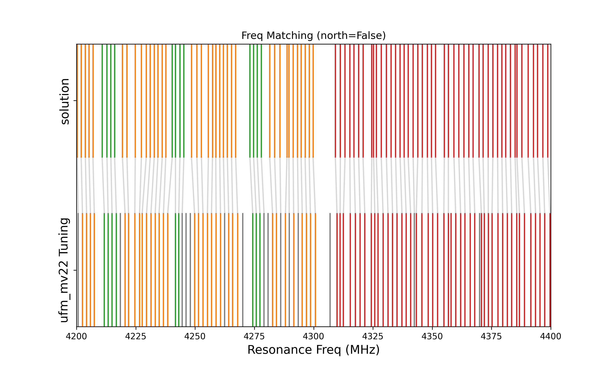

.. py:module:: sotodlib.coords.det_match

==========
DetMatch
==========

The ``sotodlib.coords.det_match`` module allows us to map resonators from one
source to another, using information such as resonator frequency, bias-line
assignments, and pointing information. This is particularly useful to create
a map from resonators in a SMuRF tune-file, to real detectors from either a
design-file, or a handmade solutions file based on a separate tune-file.

This works by translating the detector matching problem into an instance
of the well-studied assignment problem, in which, given a bipartite graph and
edge weights, one can efficiently find the minimum-cost matching.
Here, the two sets of the bipartite graph are the two resonator sets, with
additional nodes added to represent the possibility of a resonator being
unmatched. The edge weights computed using a cost-function that uses
resonator properties to determine resonator-to-resonator costs, and
resonator-to-unmatched costs. The function
``scipy.optimize.linear_sum_assignment``  is then used to find the minimum-cost
match.

Usage
--------
Below is an example of how to match a resonator-set based on a smurf tune-file
and sodetlib bgmap to a resonator-set based on a handmade solution file,
and save the output.

.. code-block:: python

    from sotodlib.coords import det_match as dm

    tunefile = <path_to_tune_file>
    bgmap_file = <path_to_bgmap_file>
    sol_file = <path_to_solution_file>

    src = dm.ResSet.from_tunefile(
        tune_file, north_is_highband=False, bgmap_file=bgmap_file,
        name=f'SAT Tuning'
    )
    dst = dm.ResSet.from_solutions(
        sol_file, north_is_highband=True, name='solution'
    )
    match = dm.Match(src, dst)

    match.save('match.h5')


To validate, you can check ``match.stats`` to see information such as how many
resonators in each set were matched or left unassigned, and to see how many
matches had bias-line mismaps, etc. If the majority of resonators have bias-line
mismaps, then it is likely the ``north_is_highband`` flag was set incorrectly,
and you are attempting to match opposite sides of the UFM.

To validate, you can also use the ``dm.plot_match_freqs`` to view how well the
resonators match in frequency space. With a proper solution file, this should
be rather well, as is seen below



Tuning Matching Params
`````````````````````````

Depending on what data you have available, you may want to tune the matching
algorithm and the cost function. For instance, once we have accurate pointing
data we'll want to rely less solely on the frequency pairings, and more on
pointing information. We can do this by passing in a MatchParams object to
set various parameters. For instance, below is an example of how to tell the
match function to be stricter with the pointing cost penalties, and more
lenient with the frequency penalty:

.. code-block:: python

    from sotodlib.io.coords import det_match as dm

    tunefile = <path_to_tune_file>
    bgmap_file = <path_to_bgmap_file>
    sol_file = <path_to_solution_file>

    src = dm.ResSet.from_tunefile(
        tune_file, north_is_highband=False, bgmap_file=bgmap_file,
        name=f'SAT Tuning'
    )
    dst = dm.ResSet.from_solutions(
        sol_file, north_is_highband=True, name='solution'
    )
    mpars = dm.MatchParams(
        freq_width=5 #MHz
        dist_width=np.deg2rad(0.3), # radians
    )
    match = dm.Match(src, dst, match_params=mpars)


API
-------
.. automodule:: sotodlib.coords.det_match
   :members:
   :undoc-members:
   :show-inheritance: