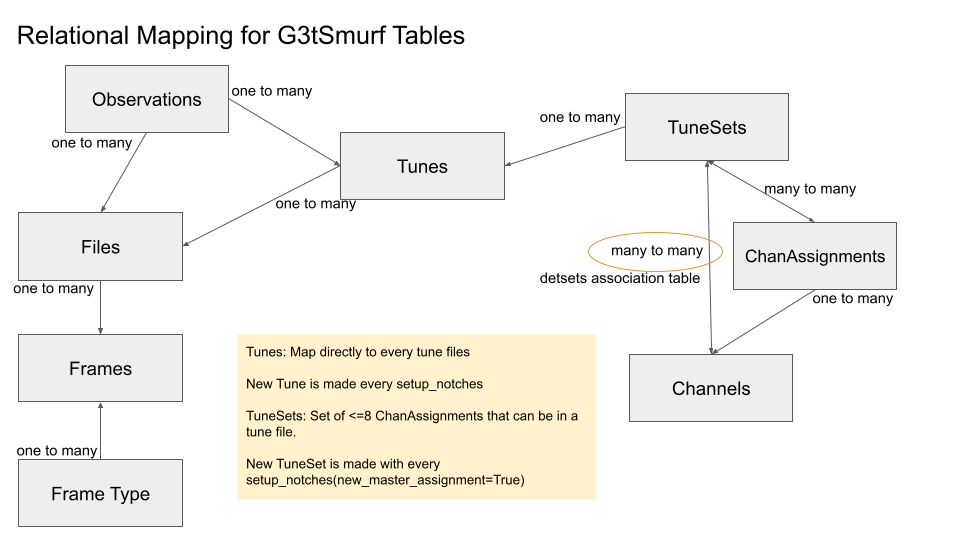

.. py:module:: sotodlib.io.load_smurf

=========
G3tSMuRF 
=========

G3tSmurf is primarily a database building system for indexing the smurf
timestreams and ancillary smurf data to produce the tables necessary for Context
and the rest of sotodlib. It also includes data loading functionality. The most
general SO user will not interact much with G3tSmurf, it will build ObsDb,
ObsFileDb, and DetDb in the background that will used to load data through
Context. Those working closely with laboratory, level 1, or level 2 site data
will likely be interacting with the databases more directly or using the
G3tSmurf loaders. 

Data Loading 
-------------

Loading without Databases
==========================
We have a function that can accept any level of .g3 smurf data and load it into 
an :ref:`AxisManager<aman-section>` with the desired schema. These AxisManagers
will not be as complete as they are when loaded with database information but 
will contain information available in the status frames such as the smurf band, 
channel mapping.

The **load_file** function only requires the filename or a list of file names::
    
    aman = load_file(filename)

Loading with this method is recommended for work directly on SMuRF servers but
**if databases are accessible** it is recommended that :ref:`G3tSmurf database
loads<g3tsmurf-load-section>` be used instead.

.. autofunction:: load_file

.. _g3tsmurf-load-section:

Loading with G3tSmurf
=====================

To load data with database information we first have to instanciate
our G3tSmurf object:: 
    
    SMURF = G3tSmurf(archive_path='/path/to/data/timestreams/',
                     meta_path='/path/to/data/smurf/,
                     db_path='/path/to/database.db')

From here we can load files, time ranges, or find individual observations. 

Load a file with database information for the readout channel names::

    aman = load_file(filename, archive=SMURF)
    
Load a specific time range, this will work whether or not the time range is
considered an observation as defined by the ObsDb / Observation table::

    aman = SMURF.load_data(start, stop, stream_id=None)
    
Start and stop can be ctimes or datetime objects. If multiple streams are
running at the same time you have to specify which one you want.

To find a specific Observation, a time when data was just streaming with no
other specific actions being run (ie: not an IV), we can search the Observation
table. Here is an example of finding the first Observation after a specific
ctime::

    session = SMURF.Session()
    obs = session.query(Observations).filter(Observations.timestamp > my_ctime)
    obs = obs.order_by(Observations.start).first()
    aman = SMURF.load_data(obs.start, obs.stop)
    
These queries are built using
`SQLAlchemy <https://docs.sqlalchemy.org/en/14/orm/tutorial.html#querying>`_
commands and can filter on any of the columns in the
:ref:`Observations<g3tsmurf-tables-section>` table.

.. autoclass:: G3tSmurf
    :members: load_data

Channel Masks on Load
======================

Since UFMs have a large number of channels and we have many long observations it
is often important to reduce active memory in some manner. One way to do that is
to reduce the number of channels we load into memory at once. 

All loading function accept a `channels` argument that is sent to the
`get_channel_mask` function. If this argument is given, only the channels in
that list will be in the returned AxisManager. The documentation for
`get_channel_mask` includes which type of information it accepts.

.. autofunction:: get_channel_mask

.. _aman-section:

G3tSmurf AxisManagers
=====================

AxisManagers loaded with G3tSmurf will all have the form::

    Axes:
        samps -- samples in the data
        dets -- channels in the data
        bias_lines (optional) -- bias information

    Fields:
        timestamps : (samps,)
            ctime timestamps for the loaded data
        signal : (channels, samps)
            Array of the squid phase in units of radians for each channel
        primary : AxisManager (samps,)
            "primary" data included in the packet headers
            'AveragingResetBits', 'Counter0', 'Counter1', 'Counter2',
            'FluxRampIncrement', 'FluxRampOffset', 'FrameCounter',
            'TESRelaySetting', 'UnixTime'
        biases (optional): (bias_lines, samps)
            Bias values during the data
        ch_info : AxisManager (channels,)
            Information about channels, including SMuRF band, channel,
             frequency.

Database Creation and Upkeep
----------------------------

All our database building scripts are based on the file system architecture
expected at the DAQ nodes. Note that this system will not work on the Smurf
Servers. The system requires the folder structure to following the pattern::

    /prefix/
        timestreams/
            16000/
                stream_id1/
                    1600000000_000.g3
                    1600000000_001.g3
                    ...
                    1600000000_XYZ.g3
                stream_id2/
                    1600000000_000.g3
                    1600000000_001.g3
                    ...
                    1600000000_XYZ.g3
            16001/
                stream_id1/
                    1600100000_000.g3
                    1600100000_001.g3
                    ...
                    1600100000_XYZ.g3
                stream_id2/
                    1600100000_000.g3
                    1600100000_001.g3
                    ...
                    1600100000_XYZ.g3
            ...
        smurf/
            16000/
                stream_id1/
                    1600000000_action1/
                    1600000ABC_action2/
                    ...
                    1600000XYZ_actionN/
                stream_id2/
                    1600000000_action1/
                    1600000ABC_action2/
                    ...
                    1600000XYZ_actionN/ 
            16001/
                stream_id1/
                    1600100000_action1/
                    1600100ABC_action2/
                    ...
                    1600100XYZ_actionN/
                stream_id2/
                    1600100000_action1/
                    1600100ABC_action2/
                    ...
                    1600100XYZ_actionN/ 
            ...

The ctimes used are just examples. But files in a specific `stream_id` folder
will be assumed to be that `stream_id`. The .g3 files with the same ctime before
the "_" will be assumed to be in the same observation/streaming session. The
metadata searches are done through the action folders and their produced
timestreams.

    
Database Creation
==================

To build a database from scratch, we create a G3tSmurf instance using a database
path that does not already exist, index the timestream folder, and then index 
the metadata folder::

    SMURF = G3tSmurf(archive_path='/path/to/data/timestreams/',
                     meta_path='/path/to/data/smurf/,
                     db_path='/path/to/database.db')

    SMURF.index_archive()
    SMURF.index_metadata()

There are options for inputting a minimum ctime if desired.

G3tSmurf Update Script
======================

Keeping the databases updated requires a little care when we are building
databases while data is actively being taken. To assist with this there is
an **update_g3tsmurf_database.py** script saved within the **pipelines** folder.
This
script takes the *data_prefix* which is the path to the main save folders and
expects to find the *timestreams* and *smurf* folders at that path. The
*db_path* is the path to the database to be created or updated. The user running
this script must have read, write, and execute permissions to that file.

Here is the help for this script:: 

    prompt>> python3 update_g3tsmurf_database.py --help

    usage: update_g3tsmurf_database.py [-h]
                                   [--timestream-folder TIMESTREAM_FOLDER]
                                   [--smurf-folder SMURF_FOLDER]
                                   [--detdb-filename DETDB_FILENAME]
                                   [--update-delay UPDATE_DELAY]
                                   [--from-scratch]
                                   data_prefix db_path
    
    positional arguments:
    data_prefix           The prefix to data locations, use individual locations
                          flags if data is stored in non-standard folders
    db_path               Path to Database to update
    
    optional arguments:
    -h, --help           show this help message and exit
    --timestream-folder TIMESTREAM_FOLDER
                         Absolute path to folder with .g3 timestreams.
                         Overrides data_prefix
    --smurf-folder SMURF_FOLDER
                         Absolute path to folder with pysmurf archived data.
                         Overrides data_prefix
    --detdb-filename DETDB_FILENAME
                         File for dumping the context detector database
    --update-delay UPDATE_DELAY
                         Days to subtract from now to set as minimum ctime
    --from-scratch       Builds or updates database from scratch
    

Building off G3tSmurf
=====================

Several of the generators used in the database indexing could be useful for
building calibration databases off the same file set.
**G3tSmurf.search_metadata_actions** and **G3tSmurf.search_metadata_files** are
generators which can be used in loops to easily page through either actions or
files. For Example::

    def find_last_action(SMURF, my_action, max_ctime=None):
        for action, ctime, path in SMURF.search_metadata_actions(self,
                        max_ctime=max_ctime, reverse = True):
            if action == my_action:
                return action, ctime, path

    def find_last_iv(SMURF, max_ctime=None):
        a, ctime, base_dir = find_last_action(SMURF, 'analyze_iv_and_save',
                                            max_ctime=max_ctime)
        files = os.listdir(os.path.join(base_dir,'outputs'))
        info = [ff for ff in files if 'analyze' in ff][0]
    
        return os.path.join(base_dir, 'outputs',info)

Usage with Context
------------------
The G3tSmurf database can now be used with the larger `sotodlib` Context system.
In this setup, the main G3tSmurf database is both the ObsFileDb and the ObsDb.
The DetDb needs to be created using the `dump_DetDb(SMURF, detdb_file)`. This
function call can be added to the standard database update script to keep it up
to date. 

.. warning::
    The DetDb setup is the least complete section of merging G3tSmurf into
    Context and there are active plans to change this setup.

Example context yaml file::

    tags:
    g3tsmurf_dir: '/path/to/things/smurf_context'

    obsfiledb: '{g3tsmurf_dir}/g3t_smurf_db.db'
    obsdb: '{g3tsmurf_dir}/g3t_smurf_db.db'
    detdb: '{g3tsmurf_dir}/detdb.db'

    imports:
    - sotodlib.io.load_smurf

    obs_loader_type: 'g3tsmurf'

    #metadata:
  

SmurfStatus
-----------

SmurfStatus objects are a used to represent and parse all the data help inside
the .g3 Status frames. These can be loaded from individual .g3 files using
`SmurfStatus.from_file(filename)`, this version does not require a database
connection. Using a database connection we can also load the Status object based
on ctime `SmurfStatus.from_time(ctime, archive)`.

.. autoclass:: SmurfStatus
   :special-members: from_file, from_time

.. _g3tsmurf-tables-section:

G3tSmurf Full API
-----------------
.. autoclass:: G3tSmurf
   :members:

Database Tables
---------------

.. autoclass:: Observations
.. autoclass:: Tunes
   :members:
.. autoclass:: TuneSets
   :members:
.. autoclass:: ChanAssignments
   :members:
.. autoclass:: Channels
   :members:

.. autoclass:: Files
   :members:
.. autoclass:: Frames
   :members:
