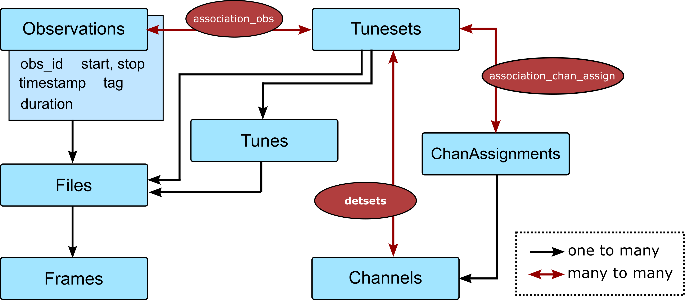

.. py:module:: sotodlib.io.load_smurf 

=========
G3tSMuRF 
=========

G3tSmurf is primarily a database building system for indexing the smurf
timestreams and ancillary smurf data to produce the tables necessary for Context
and the rest of sotodlib. It also includes data loading functionality. The most
general SO user will not interact much with G3tSmurf, it will build the ObsDb,
ObsFileDb, and DetDb databases in the background. These will used to load data through
Context. Those working closely with laboratory, level 1, or level 2 site data
will likely be interacting with the databases more directly and/or using the
G3tSmurf loaders. 

Data Loading 
-------------

Loading without Databases
==========================
We have a function that can accept any level of .g3 smurf data and load it into 
an :ref:`AxisManager<aman-section>` with the desired schema. These AxisManagers
will not be as complete as they are when loaded with database information but 
will contain information available in the status frames such as the smurf band, 
channel mapping.

The **load_file** function only requires the filename or a list of file names::
    
    aman = load_file(filename)

Loading with this method is recommended for work directly on SMuRF servers but
**if databases are accessible** it is recommended that :ref:`G3tSmurf database
loads<g3tsmurf-load-section>` be used instead.

.. autofunction:: load_file

.. _g3tsmurf-load-section:

Loading with G3tSmurf
=====================

To load data with database information we first have to instantiate
our G3tSmurf object. This is most easily done using a YAML configuration file
because those are easily shared between people. The configuration file requires
two keys::

    data_prefix: "/path/to/data"
    g3tsmurf_db: "/path/to/database.db"

This configuration file is set up so that other keys, such as a HWP prefixes or
HK prefixes could also be added. With a config file, you connect to the G3tSmurf
database as::

    SMURF = G3tSmurf.from_configs("configs.yaml")

Without a configuration file, you can directly pass the required paths::
    
    SMURF = G3tSmurf(archive_path='/path/to/data/timestreams/',
                     meta_path='/path/to/data/smurf/,
                     db_path='/path/to/database.db')

From here we can load files, time ranges, or find individual observations. 

Load a file with database information for the readout channel names::

    aman = load_file(filename, archive=SMURF)
    

.. warning::
    The SMURF.load_data function no longer has complete functionality 
    compared to load_file. Use load_file where possible. The example below shows
    how to use load_file to load a complete observation.

To find a specific Observation, a time when data was just streaming with no
other specific actions being run, we can search the Observation
table. Here is an example of finding the first Observation after a specific
ctime::

    session = SMURF.Session()
    obs = session.query(Observations).filter(
        Observations.timestamp > my_ctime
    )
    obs = obs.order_by(Observations.start).first()
    aman = load_file( [f.name for f in obs.files], archive=SMURF )
    
These queries are built using
`SQLAlchemy <https://docs.sqlalchemy.org/en/14/orm/tutorial.html#querying>`_
commands and can filter on any of the columns in the
:ref:`Observations<g3tsmurf-tables-section>` table.

Channel Masks on Load
======================

Since UFMs have a large number of channels and we have many long observations it
is often important to reduce active memory in some manner. One way to do that is
to reduce the number of channels we load into memory at once. 

All loading function accept a `channels` argument that is sent to the
`get_channel_mask` function. If this argument is given, only the channels in
that list will be in the returned AxisManager. The documentation for
`get_channel_mask` includes which type of information it accepts.

.. autofunction:: get_channel_mask

.. _aman-section:

G3tSmurf AxisManagers
=====================

AxisManagers loaded with G3tSmurf will all have the form::

    Axes:
        samps -- samples in the data
        dets -- channels in the data
        bias_lines (optional) -- bias information

    Fields:
        timestamps : (samps,)
            ctime timestamps for the loaded data
        signal : (dets, samps)
            Array of the squid phase in units of radians for each channel
        primary : AxisManager (samps,)
            "primary" data included in the packet headers
            'AveragingResetBits', 'Counter0', 'Counter1', 'Counter2',
            'FluxRampIncrement', 'FluxRampOffset', 'FrameCounter',
            'TESRelaySetting', 'UnixTime'
        biases (optional): (bias_lines, samps)
            Bias values during the data
        det_info : AxisManager (dets,)
            Information about channels, including SMuRF band, channel,
             frequency.

Database Creation and Upkeep
----------------------------

All our database building scripts are based on the file system architecture
expected at the DAQ nodes. Note that this system will not work on the Smurf
Servers. The system requires the folder structure to following the pattern::

    /prefix/
        timestreams/
            16000/
                stream_id1/
                    1600000000_000.g3
                    1600000000_001.g3
                    ...
                    1600000000_XYZ.g3
                stream_id2/
                    1600000000_000.g3
                    1600000000_001.g3
                    ...
                    1600000000_XYZ.g3
            16001/
                stream_id1/
                    1600100000_000.g3
                    1600100000_001.g3
                    ...
                    1600100000_XYZ.g3
                stream_id2/
                    1600100000_000.g3
                    1600100000_001.g3
                    ...
                    1600100000_XYZ.g3
            ...
        smurf/
            16000/
                stream_id1/
                    1600000000_action1/
                    1600000ABC_action2/
                    ...
                    1600000XYZ_actionN/
                stream_id2/
                    1600000000_action1/
                    1600000ABC_action2/
                    ...
                    1600000XYZ_actionN/ 
            16001/
                stream_id1/
                    1600100000_action1/
                    1600100ABC_action2/
                    ...
                    1600100XYZ_actionN/
                stream_id2/
                    1600100000_action1/
                    1600100ABC_action2/
                    ...
                    1600100XYZ_actionN/ 
            ...

The ctimes used are just examples. But files in a specific `stream_id` folder
will be assumed to be that `stream_id`. The .g3 files with the same ctime before
the "_" will be assumed to be in the same observation/streaming session. The
metadata searches are done through the action folders and their produced
timestreams.

.. _g3tsmurf-update-section:

Database Creation and Update Script
====================================

Keeping the databases updated requires a little care when we are building
databases while data is actively being taken. To assist with this there is
an **update_g3tsmurf_db.py** script saved within the 
**sotodlib.site_pipeline** folder. This script requires config file that is the
same as an expanded version of the one used for connecting to the G3tSmurf database::

    data_prefix : "/path/to/daq-node/"
    g3tsmurf_db: "/path/to/g3tsmurf.db"
    g3thk_db: "/path/to/g3hk.db"

    finalization:
        servers:
            - smurf-suprsync: "smurf-sync-so1" ## instance-id
              timestream-suprsync: "timestream-sync-so1" ## instance-id
              pysmurf-monitor: "monitor-so1" ## instance-id
            - smurf-suprsync: "smurf-sync-so2" ## instance-id
              timestream-suprsync: "timestream-sync-so2" ## instance-id
              pysmurf-monitor: "monitor-so2" ## instance-id

The finalization information and the HK database are required for tracking the
data transfer status between the level 1 servers and the level 2 DAQ node.

The user running this script must have read, write, and execute permissions to
the database file in order to perform updates.

Here is the information for this script:

.. argparse::
    :module: sotodlib.site_pipeline.update_g3tsmurf_db
    :func: get_parser

Utilities with G3tSmurf
------------------------

File System Searches
====================
Several of the generators used in the database indexing could be useful for
building search functions off the same file set.
**G3tSmurf.search_metadata_actions** and **G3tSmurf.search_metadata_files** are
generators which can be used in loops to easily page through either actions or
files. For Example::

    def find_last_action(SMURF, my_action, max_ctime=None):
        for action, ctime, path in SMURF.search_metadata_actions(self,
                        max_ctime=max_ctime, reverse = True):
            if action == my_action:
                return action, ctime, path

    def find_last_iv(SMURF, max_ctime=None):
        a, ctime, base_dir = find_last_action(SMURF, 'analyze_iv_and_save',
                                            max_ctime=max_ctime)
        files = os.listdir(os.path.join(base_dir,'outputs'))
        info = [ff for ff in files if 'analyze' in ff][0]
    
        return os.path.join(base_dir, 'outputs',info)

Operation Searches
====================

Many types of sodetlib operations are saved in the G3tSmurf databases and we
have many functions meant to be one-liner searches to help find sodetlib
operations relative to observations. Note, these searches are based on automatic
file tagging that was implemented in Oct. 2022. Operations from before that may
not be found.

.. autofunction:: sotodlib.io.g3tsmurf_utils.get_last_bg_map
.. autofunction:: sotodlib.io.g3tsmurf_utils.get_last_bias_step
.. autofunction:: sotodlib.io.g3tsmurf_utils.get_last_iv
.. autofunction:: sotodlib.io.g3tsmurf_utils.get_next_bg_map
.. autofunction:: sotodlib.io.g3tsmurf_utils.get_next_bias_step
.. autofunction:: sotodlib.io.g3tsmurf_utils.get_next_iv

 
Batched load of Observations
============================

Loading long large observations into memory at once can cause issues with memory
usage, especially on smaller computing facilities. This function is a generator
than can be called to automatically split observations into smaller sections.

.. autofunction:: sotodlib.io.g3tsmurf_utils.get_batch

Observation Files
==================

There are many instances where we might want to load the SMuRF metadata
associated with actions that have made it into the database. These function take
an obs_id and a G3tSmurf instance and return paths or file lists. 

.. autofunction:: sotodlib.io.g3tsmurf_utils.get_obs_folder
.. autofunction:: sotodlib.io.g3tsmurf_utils.get_obs_outputs 
.. autofunction:: sotodlib.io.g3tsmurf_utils.get_obs_plots

Usage with Context
------------------

.. py:module:: sotodlib.io.load_smurf
    :noindex:

The G3tSmurf database can be used with the larger `sotodlib` Context system.
In this setup, the main G3tSmurf database is both the ObsFileDb and the ObsDb.

A minimal example context yaml file is::

    tags:
        g3tsmurf_dir: '/path/to/things/smurf_context'

    obsfiledb: '{g3tsmurf_dir}/g3t_smurf_db.db'
    obsdb: '{g3tsmurf_dir}/g3t_smurf_db.db'

    imports:
    - sotodlib.io.load_smurf

    context_hooks: 'obs_detdb_load'

    obs_loader_type: 'g3tsmurf'

    #metadata:
  

SmurfStatus
-----------

SmurfStatus objects are a used to represent and parse all the data help inside
the .g3 Status frames. These can be loaded from individual .g3 files using
`SmurfStatus.from_file(filename)`, this version does not require a database
connection. Using a database connection we can also load the Status object based
on ctime `SmurfStatus.from_time(ctime, archive)`.

.. autoclass:: SmurfStatus
   :special-members: from_file, from_time

.. _g3tsmurf-tables-section:

G3tSmurf Full API
-----------------
.. autoclass:: G3tSmurf
   :members:

Database Tables
---------------
.. py:module:: sotodlib.io.g3tsmurf_db

.. autoclass:: Observations
.. autoclass:: Tunes
   :members:
.. autoclass:: TuneSets
   :members:
.. autoclass:: ChanAssignments
   :members:
.. autoclass:: Channels
   :members:

.. autoclass:: Files
   :members:
.. autoclass:: Frames
   :members:
